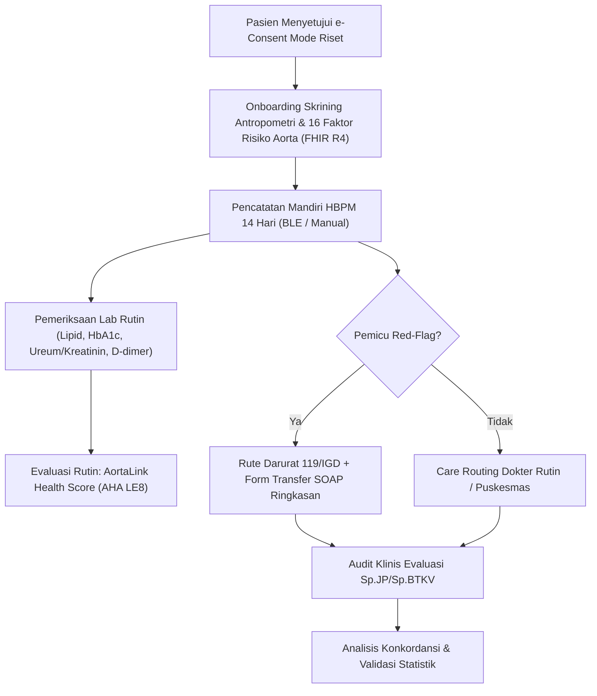

# Protokol Studi Validasi Klinis AortaLink (Mode Riset / Akademik)

**Versi Dokumen:** 1.0.0  
**Tanggal Efektif:** 4 Oktober 2026  
**Status:** Siap Pengajuan Komite Etik Penelitian Kesehatan (KEPK)  
**Regulasi Acuan:** UU No. 27 Tahun 2022 (Pelindungan Data Pribadi), Kepmenkes No. HK.01.07/MENKES/951/2026 (Standar SaMD & Clinical Evaluation)  

---

## 1. Ringkasan Eksekutif

| Parameter | Keterangan |
|---|---|
| **Judul Penelitian** | Evaluasi Akurasi Diagnostik Triase Red-Flag Sindrom Aorta Akut dan Konkordansi Kardiovaskular Health Score (AHA LE8) Berbasis Aplikasi Mobile AortaLink pada Populasi Dewasa Indonesia |
| **Desain Studi** | Studi observasional kohort prospektif multisenter non-intervensional |
| **Populasi Target** | Pasien dewasa (≥18 tahun) dengan hipertensi esensial, riwayat penyakit aorta, atau gejala nyeri dada/punggung di fasilitas pelayanan primer dan rujukan |
| **Lokasi Uji Klinis** | 1 RS Rujukan Tersier (Pusat Jantung/Vaskular) dan 2 Puskesmas/Klinik Pratama Urban/Semi-urban |
| **Durasi Studi** | 12 bulan (6 bulan rekrutmen, 6 bulan pemantauan luaran) |
| **Komite Peninjau** | Komite Etik Penelitian Kesehatan (KEPK) Terakreditasi Kemenkes RI |

---

## 2. Latar Belakang & Rasionalisasi Klinis

Sindrom Aorta Akut (Acute Aortic Syndrome / AAS), termasuk Diseksi Aorta Akut (AAD) dan ruptur Aneurisma Aorta Abdominalis (AAA), memiliki tingkat mortalitas pra-rumah sakit yang mencapai 1–2% per jam pada fase awal jika tidak terdeteksi segera. Diagnosis sering terlambat karena manifestasi klinis yang meniru sindrom koroner akut atau nyeri muskuloskeletal.

AortaLink v3.0 memperkenalkan arsitektur ganda:
1. **Mode Publik (Non-Alkes/Kelas B):** Sarana pencatatan mandiri (Personal EHR) dengan tombol darurat statis (119/112) dan daftar peringatan gejala aman.
2. **Mode Riset/Akademik:** Mengaktifkan mesin inferensi aturan red-flag deterministik (R1–R14) dan kalkulator AortaLink Health Score berbasis AHA Life's Essential 8 (LE8) dengan penyesuaian Asia-Pacific BMI.

Protokol ini disusun untuk membuktikan secara empiris bahwa inferensi deterministik on-device AortaLink memiliki sensitivitas triase yang tinggi (prinsip *safety-first*) sebelum aktivasi publik di masa depan.

---

## 3. Tujuan Penelitian

### 3.1. Tujuan Utama (Primary Objectives)
1. Mengukur **Sensitivitas** dan **Spesifisitas** algoritma triase red-flag (R1–R14) dalam mengenali kondisi darurat kardiovaskular/aorta akut dibandingkan dengan diagnosis definitif klinisi IGD (*Gold Standard* imaging CTA/Echocardiography dan biomarker).
2. Mengevaluasi **Zero Under-triage Rate** (kejadian di mana kondisi gawat aorta salah diklasifikasikan sebagai aman/rawat jalan). Target klinis: Sensitivitas ≥98.0%.

### 3.2. Tujuan Sekunder (Secondary Objectives)
1. Menilai konkordansi AortaLink Health Score (AHA LE8 unweighted 0–100) dengan beban kalsifikasi vaskular, parameter laboratorium lipid, glukosa darah, dan ketebalan intima-media karotis/aorta.
2. Mengukur tingkat kepatuhan pengguna terhadap panduan kontrol rutin dokter (Care Routing) di puskesmas/klinik.
3. Menguji keandalan transmisi telemetri Bluetooth (BLE IEEE 11073-10407 / BPS) dan stabilitas penyimpanan offline-first IndexedDB (Dexie v4) di daerah dengan keterbatasan jaringan seluler.

---

## 4. Metodologi Penelitian

### 4.1. Kriteria Inklusi
1. Pasien berusia ≥ 18 tahun yang menyetujui *e-Informed Consent* khusus Mode Riset (`ResearchConsentModal`).
2. Pasien yang memenuhi salah satu kategori:
   - Pasien rawat jalan hipertensi stadium 1, 2, atau isolated systolic hypertension.
   - Pasien dengan riwayat aneurisma aorta torakalis/abdominalis yang terkonfirmasi ultrasonografi atau CTA.
   - Pasien dengan riwayat genetik vaskular (sindrom Marfan, Loeys-Dietz, katup aorta bikuspid).
3. Memiliki smartphone Android atau iOS berkemampuan Bluetooth Low Energy.

### 4.2. Kriteria Eksklusi
1. Pasien dalam kondisi hemodinamik tidak stabil saat proses *informed consent*.
2. Pasien dengan gangguan kognitif berat yang tidak didampingi oleh wali/keluarga berwenang.
3. Pasien yang menolak partisipasi atau mencabut persetujuan riset sewaktu-waktu.

---

## 5. Alur Pengumpulan & Manajemen Data

### 5.1. Perlindungan Privasi (UU PDP No. 27/2022)
- **Zero Cloud PII:** Seluruh data rekam medis personal disimpan di penyimpanan lokal perangkat (IndexedDB Dexie v4).
- **Pseudonimisasi Berbasis Kriptografi:** Dataset penelitian yang diekspor menggunakan ID anonim ber-hash SHA-256 tanpa nama, nomor rekam medik (NRM), atau NIK terbuka.
- **Audit Hash Chain:** Setiap perubahan data dicatat dalam log integritas kriptografis yang dapat diaudit secara independen.

---

## 6. Titik Akhir & Analisis Statistik

### 6.1. Titik Akhir Klinis (Endpoints)
- **Primary Endpoint:** Sensitivitas triase red-flag darurat (R1–R9) terhadap diagnosis definitif AAS / SKA / Hipertensi Emergensi.
- **Safety Endpoint:** Tingkat kesalahan klasifikasi berbahaya (*hazard under-triage H1–H5* pada `CLINICAL_REVIEW.md`).
- **Concordance Endpoint:** *Intraclass Correlation Coefficient* (ICC) dan *Cohen's Kappa* antara rekomendasi rujukan AortaLink dengan konsensus panel spesialis kardiologi & bedah toraks kardiovaskular.

### 6.2. Rencana Analisis Statistik
1. **Analisis Sensitivitas & Spesifisitas:** Menggunakan tabel kontingensi 2×2 dengan interval kepercayaan 95% (Wilson score method).
2. **Uji Validitas Konstruk LE8:** Korelasi Pearson/Spearman antara skor LE8 dengan nilai D-dimer, kadar kolesterol non-HDL, dan arterial stiffness.
3. **Power Analysis:** Dengan estimasi prevalensi kondisi gawat 5% pada kohort suspek nyeri dada dan target sensitivitas 98%, diperlukan minimal 420 subjek untuk mencapai statistical power 85% pada alpha 0.05.

---

## 7. Publikasi & Diseminasi Ilmiah

Hasil studi ini ditargetkan untuk dipublikasikan pada:
- **Jurnal Kardiologi Indonesia (JKI)** / *Indonesian Journal of Cardiology*
- Kongres Nasional Perhimpunan Dokter Spesialis Kardiovaskular Indonesia (PERKI)
- Jurnal Internasional Bidang Medical Informatics & Digital Health (JMIR / Nature Digital Medicine)
