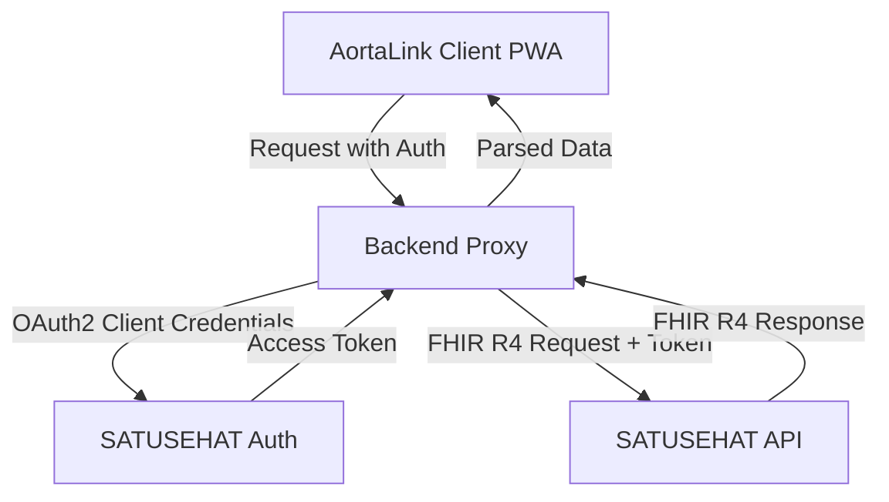

# SATUSEHAT Connector Explorer & Specification

## 1. Ikhtisar dan Arsitektur SATUSEHAT
Permenkes No. 24 Tahun 2022 mewajibkan fasyankes untuk menyelenggarakan Rekam Medis Elektronik (RME) yang terintegrasi dengan SATUSEHAT melalui standar HL7 FHIR R4. AortaLink bukan sebuah fasilitas pelayanan kesehatan (fasyankes), melainkan Personal Health Record (PHR). Namun, integrasi SATUSEHAT sangat bermanfaat untuk fungsi import/export data medis pasien.

Arsitektur SATUSEHAT berbasis RESTful API menggunakan profil spesifik Indonesia pada resource standar FHIR R4.

## 2. Persyaratan Akses untuk Aplikasi Non-Fasyankes
Berdasarkan panduan SATUSEHAT:
- Aplikasi non-fasyankes dapat mengakses SATUSEHAT API, namun dengan scope persetujuan akses khusus dari pasien.
- **Pendaftaran Sandbox:** Menggunakan DTO Kemkes DFO atau Portal SATUSEHAT.
- **URL Sandbox:** `https://api-satusehat.dto.kemkes.go.id`
- **URL Produksi:** `https://api-satusehat.kemkes.go.id`

## 3. Profil Resource & Identifiers
SATUSEHAT menambahkan constraint/ekstensi spesifik pada base profil FHIR R4:
- **IHS Number:** Identifier internal SATUSEHAT untuk entitas.
- **NIK:** Nomor Induk Kependudukan sebagai identifier untuk Pasien.
- **Resource yang digunakan:** Patient, Observation (vital signs), Encounter, dll.

## 4. Alur Otentikasi (OAuth2 Client Credentials)
API SATUSEHAT diakses menggunakan metode OAuth2 `client_credentials`.
- Endpoint: `/oauth2/v1/accesstoken?grant_type=client_credentials`
- Catatan: Di lingkungan produksi, token tidak boleh diminta langsung dari sisi frontend aplikasi klien. Arsitektur harus menggunakan *Backend for Frontend* (BFF) proxy untuk menjaga kerahasiaan `client_secret`. 

## 5. Keputusan Scope Implementasi V3.0
- **Fase V3.0:** Eksplorasi menggunakan Sandbox. Kode konektor disiapkan di `src/connectors/satusehat` dan dipisahkan dari alur aplikasi utama AortaLink.
- **Produksi:** Integrasi fungsional akan dirilis setelah fase open source ketika backend proxy sudah matang diimplementasikan.

## 6. Diagram Integrasi (Arsitektur Target)

## 7. Analisis Risiko & Regulasi
- **Regulasi Data:** Aplikasi kesehatan harus mematuhi UU PDP (Pelindungan Data Pribadi) karena AortaLink menyimpan data sensitif.
- **Keamanan:** Kredensial API tidak boleh disertakan di dalam bundle klien. Sandbox credentials hanya untuk tujuan *development* dan *testing*.

## Referensi
- Permenkes No. 24 Tahun 2022
- SATUSEHAT Implementation Guide v1
